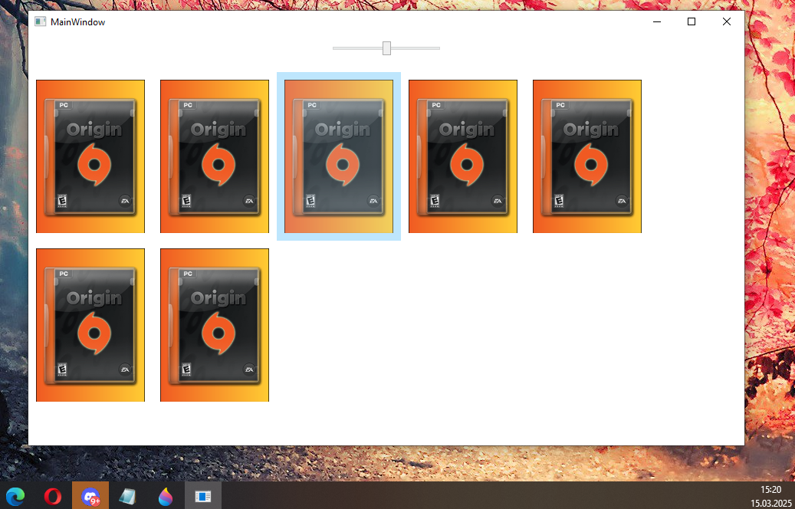

# LANOrigin
 A OpenSource Games distribute platform 

### About:
While translating for [CrazyZhang666's EA app emulator](https://github.com/CrazyZhang666/EAappEmulater) --> [my Translate](https://github.com/Tratos/EAappEmulator_EN) ,

I realized what a great alternative he's actually designed. Since everyone knows about Origin, Steam, and Epic stores, I considered designing it as a standalone games distribute platform, so I could distribute old freeware games over the network at a LAN party, just like on those platforms. I've built in some basic functionality. But I hope someone with more experience with ModernWPF can help me raise the design to CrazyZhang's level, since his client can already do a lot more, the Problem is the CrazyZhang Edition too many functions that communicate with the original EA server and pull values ​​and data that are not needed in a free app that does not have EA features.

### Why 
In a free environment, will add features, a alternative chats can be implemented that not only load games from the server but also exchange them client-to-client. Games like Blobby Volley and TrackMania Nations Forever can be created once and then simply distributed to new players without having to attend the installation process for each player.

## Security
Add SSL Security Communications to the Server Side
```
At the Moment at Client Side are deactivated, for Development Process with this function:

        public static bool ValidateServerCertificate(object sender, X509Certificate certificate, X509Chain chain, SslPolicyErrors sslPolicyErrors)
        {
            return true;
        }

```


## Gen Own Cert
Install [cygwin](https://www.ssl.com/how-to/install-openssl-on-windows-with-cygwin/)

```
openssl genrsa -out ca-key.pem 2048  (or 4096)
```
(Save this Root CA private Key File at a good and save Place) 

```
openssl req -x509 -new -nodes -extensions v3_ca -key ca-key.pem -days 4383 -out ca-root.pem -sha512

countryName US
State or Province Name: 
localityName: Raccoon City
organizationName: Umbrella Corporation
organizationalUnitName: The Hive Complex
commonName: Umbrella Corporation Root CA
```
import to clients: ca-root.pem (Public Key)

### now Make your first Certificate from the Root authority for Used:

```
openssl genrsa -out zertifikat-key.pem 2048
openssl req -new -key zertifikat-key.pem -out zertifikat.csr -sha512

countryName US
State or Province Name: 
localityName: Raccoon City
organizationName: Umbrella Corporation
organizationalUnitName: The Hive Complex
commonName: 127.0.0.1 (or your hostname: server.loc, testserver.loc, *.testserver.loc)
Email Address: admin@umbrellaCorp.loc
A challenge password: 123456
An optional company name: 
  
openssl x509 -req -in zertifikat.csr -CA ca-root.pem -CAkey ca-key.pem -CAcreateserial -out zertifikat-pub.pem -days 365 -sha512

openssl pkcs12 -export -out zertifikat-pub.pfx -inkey zertifikat-key.pem -in zertifikat-pub.pem

Enter Export Password: 123456
Verifying - Enter Export Password: 123456
```
rename zertifikat-pub.pfx to cert.pfx and copy the file at the place how have the OrginLANServer.exe installed. 

you need a tool for Certificate and Key management, i used [xca](https://hohnstaedt.de/xca)


## todo
I hope that someone can help me with the design, especially to make it a bit more similar to the original Origin, so that users can find their way around more easily.
will add Features for Ingame Chat, Discord API, RestAPI, Notifications, BallonTips. 


## the Front


